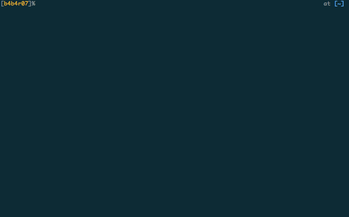

# zgencomp

[](https://travis-ci.org/b4b4r07/zgencomp "Travis CI")
[](https://raw.githubusercontent.com/b4b4r07/dotfiles/master/doc/LICENSE-MIT.txt "License MIT")

A generator for Zsh completion function

## Description

`zgencomp` is CLI tool that automatically generates a completion function for Zsh. It generates the function based on the [JSON](http://json.org) file that you wrote about user interface of your command.

***DEMO:***

[](https://github.com/b4b4r07/zgencomp#installation "b4b4r07/zgencomp")

## Requirement

- Go

## Usage

1. To generate the sample/template JSON file:

	```console
	$ zgencomp -g
	```

2. Edit the JSON file

3. To generate the completion function:

	```	console
	$ zgencomp
	```

After that you just placed the generated file to `$fpath`.

**Note:**

- If `zgencomp -g` is called without arguments, it generates `sample.json`. If you desire the name that is not a `sample.json`, it can be changed:

	```console
$ zgencomp --generate=mycmd.json
	```

- Calling `zgencomp` without any arguments reads `sample.json` in the current directory. To read other json files:

	```console
$ zgencomp mycmd.json
	```
		
For more information about `zgencomp`, type `zgencomp --help` in your Terminal.

## Installation

Paste the following commands at a Terminal prompt.

```console
$ go get github.com/b4b4r07/zgencomp
$ cd $GOPATH/src/github.com/b4b4r07/zgencomp
$ make install
```

## Just edit json

After installation, you only edit `json` file. Put the sample json file here.

**Note:**
I have extended the json file used by `zgencomp`. Thanks to that, you **can write a comment** of JavaScript style within the json file. Please check [here](./data/templates/sample.json "sample.json - GitHub/b4b4r07/zgencomp") for how to set up the json file.

```json
{
    "command" : "mycmd",
    
    "properties" : {
        "author" : "John Doe",
        "license" : "MIT",
        "help" : {
            "option" : [
                "--help"
            ],

            "description" : "Print a brief help message."
        },
        "version" : {
            "option" : [
                "-V",
                "--version"
            ],
            "description" : "Display version information and exit."
        }
    },
    
    "options" : {
        "switch" : [
            {
                "option" : [
                    "-c",
                    "--count"
                ],
                "description" : "Only a count of selected lines is written to standard output.",
                "exclusion" : [
                ]
            },
            {
                "option" :  [
                ],
                "description" : ""
            }
        ],
        "flag" : [
            {
                "option" : [
                    "-m",
                    "--max-count"
                ],
                "description" : "Stop reading the file after num matches.",
                "exclusion" : [
                    "-c",
                    "--count"
                ],
                "argument" : {
                    "group" : "",
                    "type" : "func",
                    "style" : {
                            "standard" : ["-m"],
                            "touch" : [],
                            "touchable" : [],
                            "equal" : ["--max--count"],
                            "equalable" : []
                    }
                }
            },
            {
                "option" : [
                ],
                "description" : "",
                "exclusion" : [
                ],
                "argument": {
                    "group" : "",
                    "type" : "",
                    "style" : {
                        "standard" : [],
                        "touch" : [],
                        "touchable" : [],
                        "equal" : [],
                        "equalable" : []
                    }
                }
            }
        ]
    },
    
    "arguments" : {
        "always" : true,
        "type" : "func"
    }
}
```

## Licence

Copyright (c) 2014 "BABAROT" b4b4r07

Licensed under the [MIT](https://raw.githubusercontent.com/b4b4r07/dotfiles/master/doc/LICENSE-MIT.txt).
